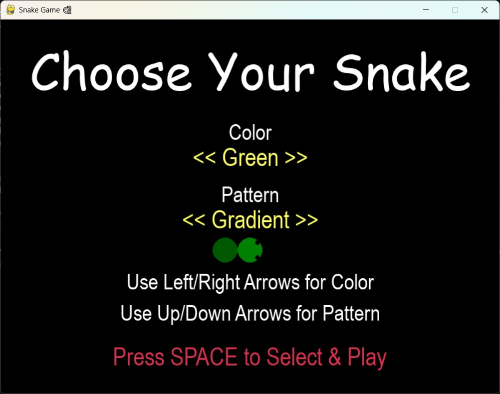
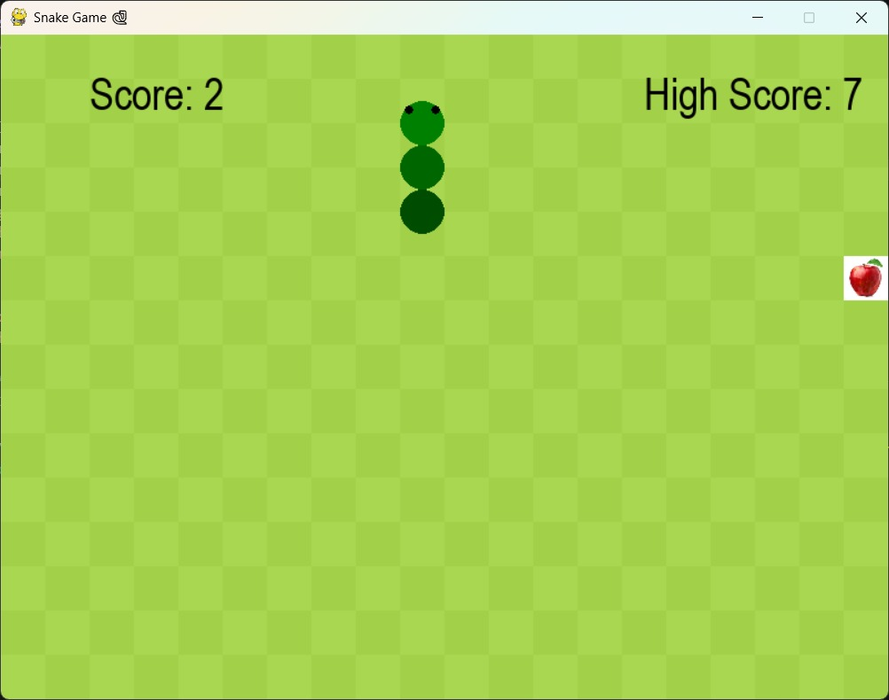
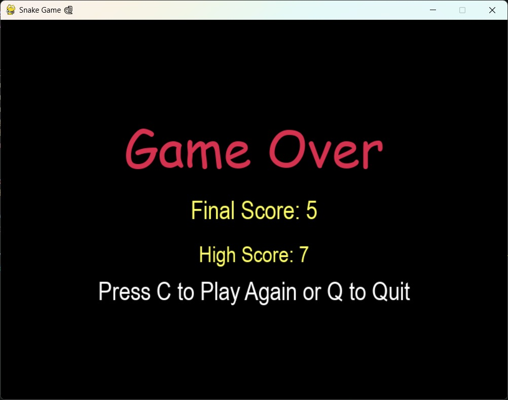

# Snake Game

A classic Snake game built with Python and Pygame. This was a fun project to practice game loops, event handling, collision detection, and basic 2D graphics.





## Features

- Classic snake gameplay — eat apples, grow longer, avoid crashing
- **Custom skin selection screen** — choose your snake's color and pattern before you play
  - 5 color options: Blue, Red, Yellow, Purple, Green
  - Solid or Gradient body pattern
- Animated snake head with directional eyes
- Checkered background
- Persistent high score saved to a local file
- Game speeds up as your score increases
- Game over screen with option to replay or quit

## Requirements

- Python 3.0
- [Pygame](https://www.pygame.org/)

Install Pygame with:

```bash
pip install pygame
```

## Getting Started

1. Clone the repository:

```bash
git clone https://github.com/Akatsk02/Snake-game.git
cd Snake-game
```

2. Make sure `apple.png` is in the same folder as the script (needed for the food graphic).

3. Run the game:

```bash
python snake_game.py
```

## Project Structure

```
Snake-game/
├── snake_game.py # Main game code
├── apple.png # Apple image used for food
├── highscore.txt # file that stores your high score
└── README.md
```

## What I Learned

This project helped me practice:

- Structuring a game using Pygame's main loop and `clock.tick()`
- Handling keyboard input and preventing the snake from reversing into itself
- Working with `pygame.Rect` for collision detection
- Reading/writing simple data (high score) to a text file
- Building a simple menu/selection screen before the main game state

## Possible Future Improvements

- Add sound effects and background music
- Add a pause feature
- Add difficulty levels (easy/medium/hard speed presets)
- Add walls-off mode where the snake passes through the walls and only dies when it hits itself.

## AI disclosure
-gemini(free tier) was used in the building of this game.However, it was used for assistance mainly in implimentation and debugging rather than in designing the project.
